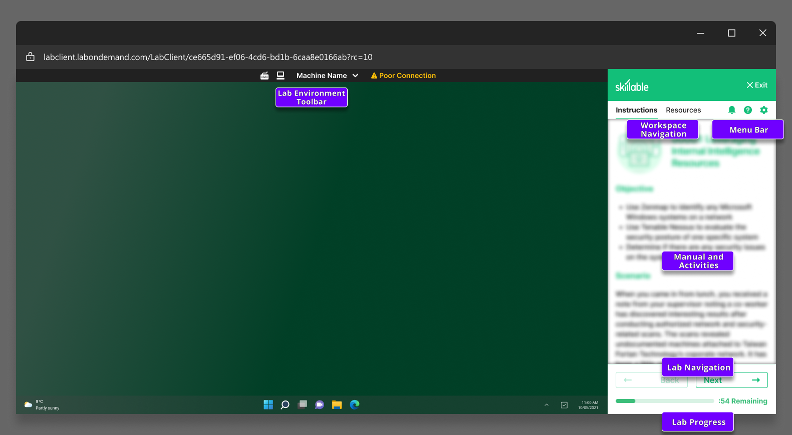
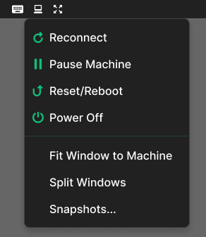

This guide helps learners and candidates navigating and getting acquainted with the Skillable Labs user interface. The Lab User Interface is Skillable's client to deliver labs, gives access to lab manual, and provides the hands-on, real-world, scenario-based training environments.

## Overview of the Lab Interface 

### Getting Started
In general, when a learner or candidate launches a lab, the Lab interface is displayed in two different configurations, depending on the lab components used when the lab was built:

- Virtualization based labs are displayed in a single browser window.

- Some Cloud-based labs may be displayed in two browser windows.

## Lab Interface Layout
The main window of Skillable Labs is split in two. On the left is the training real-world learning environment (e.g., a virtual machine), and on the right is the lab manual, which is a set of instructions, scenarios, and activities relating to the skills' training environment.

Here are the main areas in the Lab Interface:

*  **Lab Environment Toolbar**: These controls enable the user to interact with the lab environment (e.g. virtual machine). Here you can find the Command Controls menu, the Display menu, and information of the current lab environment.

* **Workspace Navigation**: Here users may find the main lab instructions and extra resources that are used in the current lab environment such as credentials for virtual machines, cloud environments, etc.. 

* **Menu Bar**: The menu bar provides quick access to notifications, help, and settings.

* **Manual and Activities**: Here the users will find the scenarios, instructions, and activities to complete in the lab environment.

* **Lab Navigation**: These controls allow the user to navigate through the content of the lab manual.

* **Lab Progress**: This bar provides the current progress status of where the user is and the remaining time (where applicable) they have on the current lab.

## Lab Interface Components

>[!alert]  Controls might look different)
Some buttons or menus may not be available to you, depending on your account configuration
:::

1. **Commands menu**: Contains advanced lab functions. See the  [Commands menu](#commands-menu) section for more information. 

1. **VM menu**: Contains virtual machine commands and display settings. See the [VM menu](#vm-menu) section for more information. 

1. **Full-screen**: Maximizes the lab window with both, the lab environment and the lab instructions, into full-screen. You can hit the **Escape**(Esc) key to exit full-screen mode.

1. **VM Switcher**: This is a special control that shows when there are multiple virtual machines attached to the lab. You may switch between virtual machines easily using this control.

1. **Connection status**: Indicates when there are connection issues between your local computer and Skillable's Labs.

1. **Instructions panel**: Displays the lab instructions and activities. 

1. **Resources panel**: Contains lab resources such as virtual machines, cloud resources, and any credentials needed to complete the lab instructions. This is also where you can load files into your virtual machine. 

1. **Exit & Save menu**: The Exit & Save Menu provides options for learners and candidates to save, disconnect or end their current lab. 

>[!knowledge] Please note when you save your lab, the expiration date and time that is displayed after you save your lab. Once the expiration date and time has elapsed, the lab is cancelled and any work in the lab will be lost. 

9. **Help**: Opens a popup offering lab details for support, along with access to FAQs and additional help options, including general assistance and bug reporting.

1. **Settings**: The Settings icon centralizes diverse functionalities for user customization, encompassing options for language, display preferences, tools and other various actions over the current lab.  See the [Settings menu](#settings-menu) section for more information.

1. **Instruction Resizer**:  Drag left and right to adjust the size of the instruction pane. 

1. **Navigation Controls**: Navigates to the previous or next page in the lab instructions.

1. **Lab Progress**: This area visually tracks the current lab's advancement and the remaining time left.

### Commands Menu 
The Commands Menu in Skillable Labs provides users with advanced functionalities to interact with the virtual machine or cloud platform used in the lab. It offers a range of commands from basic keyboard, enhancing the user's control over the lab environment. Users would typically access this menu to perform specific actions that facilitate their learning experience or to troubleshoot issues within the lab.

>[!knowledge] The Commands menu is not available in labs that do not use virtual machines. 

1. **Ctrl+Alt+Delete**: Sends the Ctrl-Alt-Delete key combination to the virtual machine. 
1. **ALT+Tab**: Sends the ALT+Tab key combination to the virtual machine. 
1. **Windows Key**: Sends the Windows key command to the virtual machine. 
1. **Type Text**:  

    A. **Type Username**: Types the username into the virtual machine at the current cursor position.

    B. **Type Password**: Types the password into the virtual machine at the current cursor position.

    C. **Type Clipboard Text**: Opens a dialog box to paste text into from your local clipboard, and paste into the virtual machine at the current cursor position. 

1. **Virtual Keyboard**: This enables an on-screen virtual keyboard that can be used to input keystrokes into the virtual machine. 

1. **Reset Internet Gateway**: Resets the gateway that the virtual machine uses to connect to the internet. 

### VM Menu 
The Virtual Machine Menu is a useful feature that allows users to send power commands, adjust the appearance and connection of the virtual machine in the lab. You may need this menu to send power commands to the current VM, optimize their viewing experience, fit the virtual machine to their browser window size, or reconnect to the lab if the connection is lost.

1. **Reconnect**: This will reconnect your local machine to the remote virtual machine, if the connection is interrupted. 
1.  **Pause Machine**: This puts the virtual machine into a paused state. Once it is paused, it must be resumed to continue using the virtual machine. 
    
1. **Reset/Reboot**: This reboots the virtual machine. This **does not** gracefully shut down the machine. It is recommended to save your work before using this. 
    
1. **Power Off**: This powers down the virtual machine. 
1. **Fit Machine to Window**: This resizes the virtual machine to fit the browser window. 
1. **Split Windows**: This resizes the virtual machine to fit the browser window. 
1. **Snapshots**: Allows you to save a new snapshot or manage existing snapshots.

### Settings Menu
The Settings Menu acts as a hub for user customization, providing functionalities such as editing instructions, installing integration tools, adjusting language preferences, and modifying display settings like text size and color mode. Users would visit this menu to tailor their experience based on individual preferences and requirements, ensuring optimal usability and personalization.

#### Developer Tools:
1. **Edit Instructions** This allows lab authors to edit the instructions that are displayed in the instruction pane of the lab. 
1. **Install Integration Tools**: This installs the Skillable Studio Integration Service. This allows automatic screen resizing (limited resolutions)
 and executing UI commands within a virtual machine. 
 1. **Commit changes**: This brings up that allows you to commit your changes with different options:

    * **Commit my changes to this lab profile**: This allows lab authors to commit changes to virtual machines in the lab, so that subsequent lab launches will contain those changes. 

    * **Commit my changes and create a new lab profile**: This allows lab authors to commit changes to virtual machines in the lab and save a new lab profile with the changes. 
1. **Languages**: The language selector displays the available languages for the current instructions manual, and allow learners and candidates to switch instantly to the selected language.

1. **Text Size**: Enables users to dynamically adjust the text size in the instructions manual, providing instant customization.

1. **Color Mode**: Allows modifying the theme of the instructions manual with the available options provided, and High Contrast, for accessibility needs. A click on any of these options instantly transforms the visual appearance of the interface for an enhanced and custom user experience.

#### Actions
7. **Split Windows**: This allows splitting the windows into two separate windows; with the Virtual machine in one window, and the lab instruction pane in another window. After windows are split, this button will change to display _Join Windows_, this is used to join the windows back together into a single browser window. 
8. **Share**: This opens the *Share this lab instance* dialog, here you can input an email address to share the lab with another user.
9. **Transfer**: Allows students and learners to transfer this lab to another user. When the dialog opens you can input the email address of the recipient of the lab instance.

<!--
## Lab Interface FAQ

To read frequently asked questions about the lab interface, read [Lab Interface FAQ](/lod/lab-interface-faq.md).
-->
